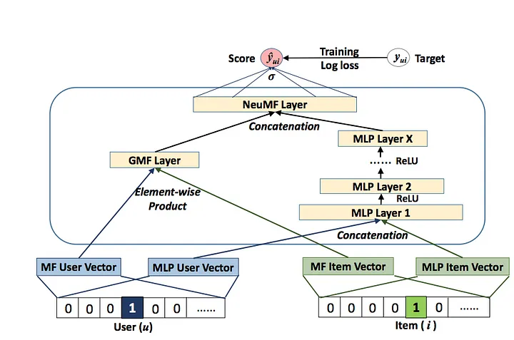

# Neural Collaborative Filtering
This is our TensorFlow implementation for the paper:
neural collaborative filtering (WWW 2017)
Author: Xiangnan He (http://www.comp.nus.edu.sg/~xiangnan/)

## 2. Dataset
the dataset from original author's repo: https://github.com/hexiangnan/neural_collaborative_filtering

## 3. Environment Settings
We use Tensorflow keras to implement our method. The version requirement is as follows:
* tensorflow == 2.13.x
* numpy == 1.18.5
* scipy == 1.7.3
* python == 3.7.11

## 4. Example to run the codes.
The instruction of commands has been clearly stated in the codes (see the  parse_args function).
```angular2html
python main.py 
```
